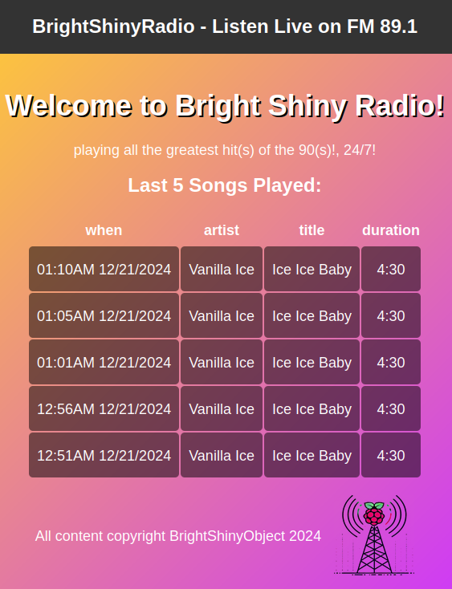

# BrightShinyRadio: A Raspberry Pi FM Radio and AWS Website Combo



Welcome to BrightShinyRadio! This is a playful and straightforward project that merges Raspberry Pi FM broadcasting with a retro-themed website to display playlist history. Think of it as your DIY mini-radio station with a web presence, all wrapped in 90s nostalgia.

What started as a proof-of-concept for AWS Lambda functions quickly spiraled into something much more fun. Inspired by quirky radio stations that play the same song repeatedly, I decided to recreate the experience with items I had lying around.

The result? A Raspberry Pi broadcasting a single song and an accompanying website to share the playlist details. Let’s dive into the details so you can build your very own BrightShinyRadio station.

---

## What’s Inside?

- **FM Radio**: Broadcast a single `.wav` file using a Raspberry Pi.
- **AWS Integration**: Store and retrieve playlist data with DynamoDB and Lambda.
- **Retro Website**: Display your station’s playlist in an eye-catching 90s design.

### How It Works
1. The Raspberry Pi transmits a `.wav` file as an FM signal and posts the song details to AWS.
2. AWS Lambda stores the data in DynamoDB and serves it as a JSON response.
3. The website fetches and displays the playlist details for visitors.

---

## Features
- Broadcast a single song in `.wav` format.
- Automatically log song details (artist, title, duration) via AWS Lambda.
- Display the last five songs played on the website.

**Heads Up!**
1. **Cost Alert**: Hosting the website on AWS incurs a small cost (~$1/month in low-traffic scenarios). Ensure you’re comfortable with potential expenses before proceeding.
2. **Legal Compliance**: Ensure broadcasting FM signals is legal in your region.
3. The installer script disables HDMI on your raspberry pi to save energy.  Delete the line "/usr/bin/tvservice -o" from /etc/rc.local and reboot to turn it back on.
---

## What You’ll Need


### Raspberry Pi Setup
- **Hardware**:
  - A Raspberry Pi (Pi 1 through Pi 4).
  - MicroSD card (minimum 5GB).
  - 20-40 cm solid core wire for the antenna.
  - Dupont connector or similar for attaching antenna to GPIO4.
  - Network connection (wired or wireless).
- **Software**:
  - Raspberry Pi OS Lite (64-bit preferred).

### Cloud Accounts
- AWS with Terraform configured.

### Audio File
- A `.wav` file in the correct format:
  ```bash
  sox my_file.mp3 -r 22050 -c 1 -b 16 -t wav > song.wav
  ```
  If using `ffmpeg`, add the `-flags bitexact` option.

---

## Setting Up BrightShinyRadio

### 1. AWS Lambda Setup
1. Navigate to the `lambda-function` directory.
2. Update `main.tf` to reflect your preferred AWS region.
3. Run:
   ```bash
   terraform init && terraform apply
   ```
4. Note the Lambda endpoint URL.
5. Test the function using `test-request.sh` and confirm it works.

### 2. Website Setup
1. Navigate to the `html-site` directory.
2. Update:
   - `terraform.tfvars` with your AWS region.
   - `dist/script.js` with your Lambda endpoint URL.
3. Deploy the website with:
   ```bash
   terraform init && terraform apply
   ```
   It should end with
   ```
   Outputs:

   site_url = "http://radio-RANDOMID.s3-website-us-east-1.amazonaws.com"
   ```
   That you can visit in a browser.

### 3. Raspberry Pi Setup
1. Install Raspberry Pi OS Lite on the MicroSD card. Use [Raspberry Pi Imager](https://www.raspberrypi.com/documentation/computers/getting-started.html#install-using-imager) for an easy setup.  Configure network (WiFi or Ethernet) and enable SSH if using a headless setup.
2. Cut antenna [to match your frequency](http://www.csgnetwork.com/antennagenericfreqlencalc.html) at 1/4 wavelength and attach to GPIO4.
3. Transfer your `.wav` file to the Pi:
   ```bash
   scp song.wav pi@<hostname>.local:
   ```
4. SSH into the Pi and run the installer:
   ```bash
   bash -c "$(curl -sL https://raw.githubusercontent.com/jasonmce/bright-shiny-radio/refs/heads/main/pi/install-pi-software.sh)"
   ```
5. Customize `player.ini` as needed.
6. Reboot:
   ```bash
   sudo reboot
   ```
7. Tune your FM receiver to enjoy your station!

---

## Enjoy Your BrightShinyRadio Station
Once everything is set up, you’ll have your own mini radio station broadcasting a single song, complete with a retro-themed website to show off your playlist. Whether for fun, nostalgia, or a creative project, BrightShinyRadio is here to spread nerdy joy within a 100-meter radius. 🎵📻

Got questions or need help? Check out the [documentation](https://github.com/jasonmce/bright-shiny-radio) or open an issue in the GitHub repo. Happy broadcasting!

## Thanks to!
[Whip Antenna Length And Frequency Calculator](http://www.csgnetwork.com/antennagenericfreqlencalc.html)

[Marcin Kondej's FM Transmitter project](https://github.com/markondej/fm_transmitter)

[ChatGPT](https://chatgpt.com) For the spiffy 90's Radio Station website improvements

[Convertio](https://convertio.co/) For generating the .ico file

[Thomas Vanhoutte](https://thomas.vanhoutte.be/miniblog/how-much-energy-does-a-raspberry-pi-use-per-year-cost-calculation/)'s blog post on energy saving
